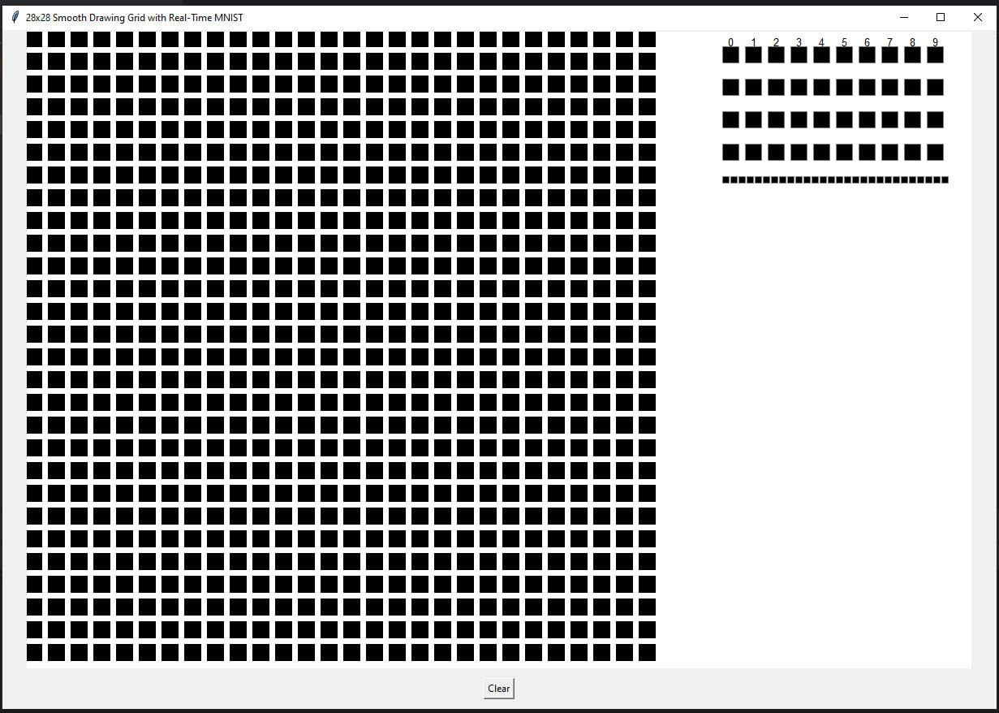

## Real-Time Digit Recognizer

An **interactive neural network visualization** built with **Tkinter** and **NumPy** that lets you draw digits on a 28×28 canvas and see, in real-time, how each neural layer reacts.

This project is designed to **help students and beginners understand** how simple deep learning models process information — from input pixels to hidden activations and final predictions.

---

### Purpose

During my exploration of neural networks, I built this project to **demonstrate visually** what happens inside a model when it recognizes a digit.
It displays intermediate values for:

* `G1` → First layer’s linear transformation
* `Y1` → ReLU activation output
* `G2` → Second layer’s linear transformation
* `Y2` → Final SoftMax output

The tool updates in real-time as you draw, showing how the neural network’s inner layers respond dynamically.

---

### Features

*  **Draw digits** directly on a 28×28 grid (similar to MNIST inputs)
*  **Real-time updates** of all layers (`G1`, `Y1`, `G2`, `Y2`)
*  **Layer visualization** to understand activations and transformations
*  **Clear button** to reset the grid and experiment with new digits
* ️ Uses **pre-trained weights** (`W1_3.npy`, `B1_3.npy`, `W2_3.npy`, `B2_3.npy`)

---

### How It Works

1. The drawn pixels form a 28×28 grayscale image matrix (`Img`).
2. The image is normalized and passed through:

   * **Layer 1:** `G1 = W1·X + B1`, then `Y1 = ReLU(G1)`
   * **Layer 2:** `G2 = W2·Y1 + B2`, then `Y2 = SoftMax(G2)`
3. Each layer’s output is displayed on the right side of the window — darker cells indicate stronger activations.

---

### Requirements

Make sure you have:

```bash
pip install numpy
```

Tkinter comes pre-installed with most Python distributions.

---

### Run the Program

1. Place your trained weights in the same directory:

   ```
   W1_3.npy
   B1_3.npy
   W2_3.npy
   B2_3.npy
   ```
2. Run the script:

   ```bash
   python real_time_digit_recognizer.py
   ```
3. Draw a number with your mouse — see the network process it live!

---

### Educational Use

This project is ideal for:

* Teaching neural network concepts visually
* Demonstrating how forward propagation works
* Showing how intermediate activations change with different inputs

---

### Example

> *Screenshot*
> 

---

### Author

**Abbos Zaitov**
Passionate about AI, deep learning, and educational visualization tools.

